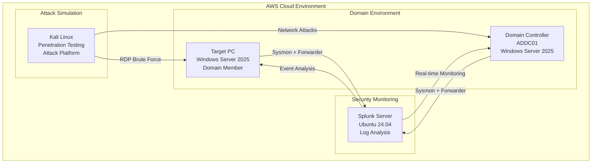

# Active Directory Project

<div align="center">


**Enterprise Active Directory Lab with Advanced Threat Detection & Response**

</div>

---

## 🎯 Project Objective

The objective of this project is to build a comprehensive **Active Directory home lab** in an AWS EC2 environment, integrating key security tools such as **Splunk**, **Kali Linux**, and **Atomic Red Team**. This setup provides hands-on experience with understanding and managing a domain environment, learning how to ingest events into Splunk, and generating telemetry data to simulate real-world cyber attacks. The primary goal is to enhance the ability to detect and respond to security incidents by analyzing attack patterns and data streams, ultimately improving future detection capabilities.

  
**REF 1 - Logical Diagram of Active Directory Project**

---

## 🎓 Skills Learned

- **Active Directory Management**: Gained experience in setting up and managing an Active Directory environment, including domain controllers, user management, and group policies
- **AWS EC2 Management**: Developed proficiency in launching and configuring AWS EC2 instances, networking, and ensuring proper security configurations for cloud-based infrastructure
- **Security Tool Integration**: Learned how to configure and integrate security tools like Splunk for event monitoring and analysis, Kali Linux for penetration testing, and Atomic Red Team for simulating attack techniques
- **Event Ingestion & Analysis with Splunk**: Developed the ability to ingest security-related logs and telemetry data into Splunk, creating alerts and dashboards to detect malicious activities and anomalies
- **Penetration Testing & Attack Simulation**: Gained practical experience in using Kali Linux for vulnerability scanning and penetration testing, and using Atomic Red Team to simulate a variety of cyber attacks
- **Threat Detection & Incident Response**: Enhanced skills in threat hunting and incident response by analyzing the data generated by simulated attacks, identifying attack patterns, and preparing actionable insights for security improvement

---

## 🛠️ Tools Used

<div align="center">

| **Category** | **Tool** | **Purpose** |
|--------------|----------|-------------|
| **Cloud Platform** | AWS EC2 | Hosting and managing the virtual environment for all components |
| **Directory Services** | Active Directory | Simulating real-world domain environment with users, groups, and policies |
| **SIEM Platform** | Splunk | Log ingestion, analysis, search queries, and security event visualization |
| **Penetration Testing** | Kali Linux | Vulnerability assessments and attack simulation against AD infrastructure |
| **Attack Simulation** | Atomic Red Team | Simulating known attack techniques and generating telemetry data |
| **Brute Force Tool** | Hydra | Network login cracking for testing authentication security |

</div>

---

## 🏗️ Architecture Overview

<div align="center">



</div>

---

## 📋 Implementation Steps

### ☁️ Launch 2 Windows Server, 1 Ubuntu Server and 1 Kali Linux instance in AWS

- One Windows Server will be our **Target-PC**
- The other Windows Server will be our **Active Directory (ADDC01)**
- Ubuntu Server will be our **Splunk Server**
- Kali Linux will be our **attacker machine**

All the servers must be in the same subnet

#### 🔧 Configuration on AWS for launching instances

**Windows Server (Target-PC)**
```
Name: Target-PC
OS: Microsoft Windows Server 2025 BASE
Instance Type: T3 Medium (2 vCPU and 4 GiB RAM)
Storage: 50 GB
Network: Same security group for all instances
```

**Windows Server (Active Directory - ADDC01)**
```
Name: ADDC01
OS: Microsoft Windows Server 2025 BASE
Instance Type: T3 Medium (2 vCPU and 4 GiB RAM)
Storage: 50 GB
Network: Same security group for all instances
```

**Ubuntu Server (Splunk Server)**
```
Name: Splunk Server
OS: Ubuntu Server 24.04 LTS
Instance Type: T3 Large (2 vCPU and 8 GiB RAM)
Storage: 100 GB
Network: Same security group for all instances
```

**Kali Linux**
```
Name: Kali Linux
OS: Kali Linux AMI
Instance Type: T2 Medium (2 vCPU and 4 GiB RAM)
Storage: 30 GB
Network: Same security group for all instances
```

  
**REF 2 - All EC2 Instances launched for Active Directory Project and all servers are in the same subnet**

### 📊 Installing Splunk on The Ubuntu Server (Splunk Server)

**SSH into the Splunk Server and enter the following commands to install Splunk:**

```bash
sudo apt-get update && sudo apt-get upgrade
wget -O splunk-9.2.2-d76edf6f0a15-linux-2.6-amd64.deb "https://download.splunk.com/products/splunk/releases/9.2.2/linux/splunk-9.2.2-d76edf6f0a15-linux-2.6-amd64.deb"
sudo apt install ./splunk-9.2.2-d76edf6f0a15-linux-2.6-amd64.deb
sudo /opt/splunk/bin/splunk start --accept-license
```

- Press and enter **Y** to accept the licence and proceed with the installation
- Create your username and password for splunk log in

```bash
sudo /opt/splunk/bin/splunk start
```

  
**REF 3 - Splunk Installed Successfully**

If you see above screen where it says that the web interface is available at the privateIP:8000, then splunk is installed successfully

**After Splunk is installed on the splunk server, you can access the splunk web from your local machine:**

- Go to Amazon EC2 instances page and check the public IP Address of the Splunk Server instance
- Go to your local machine's web browser and enter the address as **http://publicIP of splunk server:8000** - In my case the address is http://43.204.233.77:8000

  
**REF 4 - Splunk Web Interface**

- Enter your credentials to log in

### 📡 Installing Splunk Forwarder and Sysmon on Windows Server (Target-PC)

#### 🖥️ RDP into the windows server and change the PC name to Target-PC

- Open any RDP client and gain the remote access of the windows server (Target-PC)
- Click on search on the taskbar and type **"View your PC Name"**
- Click on **View your PC Name**
- Click **Rename this PC**
- Type **"Target-PC"** and click **Next**
- Click **Restart Now** (The remote desktop connection will also be lost)
- RDP into the server again and go to View your PC Name and you will see the PC name is successfully changed to **"Target-PC"**

  
**REF 5 - PC name changed to "Target-PC"**

#### ⬇️ Installing Splunk Universal Forwarder and Sysmon

- On Target-PC, go to web browser and go to **splunk.com**
- Log in using your Splunk Credentials
- Go to **Products > Free Trial and Downloads**
- Scroll down to **Universal Forwarder** and click on **Get My Free Download**
- Go to **Previous Releases** and download the version same as the version you have installed on the Splunk Server
- In my case the version of the Splunk is **9.2.2** so I have downloaded **9.2.2** Splunk Forwarder
- Open the downloaded MSI file
- Check the box for **License Agreement** and check **"As on-premise Splunk Enterprise Instance"** and click **Next**
- Create a username and password and click **Next**
- We don't have a deployment server so we can skip this option by clicking **Next**
- For the Receiving Indexer, enter the IP Address of the host as the **private IP Address of Splunk Server** and the port will be **9997**

  
**REF 6 - Configuring the Receiving Indexer on Splunk Forwarder while installation**

- Click **Next** and Click **Install**
- After Installation click on **Finish**
- Go to Browser and search **sysmon download** and click on **Sysmon - Sysinternals** from Microsoft
- Scroll down and click on **Download Sysmon**
- Go to browser again and search **sysmon olaf config** (We will use olaf sysmon configuration)
- Click on the GitHub page, scroll down and click on **sysmonconfig.xml**
- Click on **Raw**, then right click > **Save as** and save in your Downloads folder
- Go to your Download Directory then right click on Sysmon zip file and click **extract all**
- Click on the address bar and copy the file path (**C:\Users\Administrator\Downloads\Sysmon**)
- Open **Powershell (Run as admin)**

```powershell
cd C:\Users\Administrator\Downloads\Sysmon
.\sysmon.exe -i ..\sysmonconfig.xml
```

- Click **Agree**

  
**REF 7 - Sysmon is installed successfully**

#### ⚙️ Configuring Splunk Universal Forwarder on Target-PC to Send Data to Splunk Server

- For our splunk forwarder to forward the data, we will have to create and configure **inputs.conf** in the local configuration folder
- On Target-PC go to **C:\Program Files\SplunkUniversalForwarder\etc\system\local**
- Right Click and **New > Text Document**
- Paste the following configuration:

```
[WinEventLog://Application]
index = endpoint
disabled = false

[WinEventLog://Security]
index = endpoint
disabled = false

[WinEventLog://System]
index = endpoint
disabled = false

[WinEventLog://Microsoft-Windows-Sysmon/Operational]
index = endpoint
disabled = false
renderXml = true
source = XmlWinEventLog:Microsoft-Windows-Sysmon/Operational
```

- Click **File > Save As** and select the **'Save As Type'** as **All Files** and enter the **'File Name'** as **inputs.conf** then click **Save**
- After creating or updating our inputs.conf configuration file, we should restart our universal forwarder in order for the changes to take effect
- Click **Search** on the taskbar, search and open **Services**
- Scroll down until you find **SplunkForwarder**

  
**REF 8 - SplunkForwarder in Services**

- Check it's **Log On As** Column in Splunk Forwarder

  
**REF 9 - Splunk Forwarder logged in as NT SERVICE\SplunkForwarder**

- If **'Log On As'** is **NT SERVICE\SplunkForwarder**, the forwarder might not be able to collect the logs due to some of the permissions
- To fix this, change the **'Log On As'** option to **Local System**
- Right Click on **SplunkForwarder** and click **properties**
- Click on **Log On** tab and select **Local System account** and click **Apply** and **OK**
- Restart the service

Now we have our splunk forwarder and sysmon installed along with it's configuration on Target-PC

### 🔧 Configuring Splunk Server to receive the logs

#### 📋 Creating 'endpoint' index in the splunk server to receive the logs from 'Target-PC'

- In inputs.conf file, we have mentioned in our configuration **'index=endpoint'**
- Let's create an index **endpoint** in Splunk Server to receive the logs as the data from Target-PC will go to that index
- Log in to the Splunk Web Interface (**http://43.204.233.77:8000**)
- Click on **Settings > Indexes**
- Click on **New Index**

  
**REF 10 - Creating New Index Splunk Server**

- Enter the Index Name as **'endpoint'** and click on **Save**  
Index **'endpoint'** is now created in our splunk server

  
**REF 11 - endpoint Index Created**

#### 📡 Configure our Splunk Server to receive the data

- Go to **Settings > Forwarding and receiving**
- Click on **Add New** under **Receive Data**

  
**REF 12 - Adding new receiving port**

- In **'Listen on this port'** field, enter **9997**
- Click **Save**

#### 🔍 Searching on Splunk Server to verify if we are receiving the logs from Target-PC

- Click **Apps** on Splunk Web and click on **Searching and Reporting**
- Search **index="endpoint"**
- You will see the logs from our Target-PC which verifies that we are receiving the logs

  
**REF 13 - Received logs from our Target-PC**

### 🔄 Installing Splunk Forwarder and Sysmon on Windows Server (Active Directory - ADDC01)

#### 🖥️ RDP into the other windows server and change the PC name to ADDC01

- Open any RDP client and gain the remote access of the windows server (ADDC01)
- Click on search on the taskbar and type **"View your PC Name"**
- Click on **View your PC Name**
- Click **Rename this PC**
- Type **"ADDC01"** and click **Next**
- Click **Restart Now** (The remote desktop connection will also be lost)
- RDP into the server again and go to View your PC Name and you will see the PC name is successfully changed to **"ADDC01"**

  
**REF 14 - PC name changed to "ADDC01"**

#### ⬇️ Install and Configure Splunk Universal Forwarder and Sysmon on (ADDC01)

- Repeat the same steps we did to install and configure Splunk Universal Forwarder and Sysmon on Target-PC
- Once everything is done successfully you will see 2 hosts when searching in the endpoint index on our Splunk Server

  
**REF 15 - Receiving logs from the 2 hosts Target-PC and ADDC01**

Both Target-PC and ADDC01 have sysmon and splunk forwarder installed and they are configured to forward the logs to our splunk server. From the above, we can say that we are receiving the logs from both the hosts successfully.

### 🏢 Installing and Configuring Active Directory on ADDC01

#### 📥 Install Active Directory Domain Service

- Go to search and search **'Server Manager'**
- Click on **Manage > Add Roles and Features**

  
**REF 16 - Adding Roles and Features**

- Click **Next**
- Select **Role-based or featured-based installation**
- Your default server will be selected. Click **Next**
- From the list, click on **Active Directory Domain Services**

  
**REF 17 - Adding server role - Active Directory Domain Services**

- Click on **Add Features**
- Keep on clicking **next** until you get **Install** button
- Click on **Install** and wait for it to get installed until you see **"Configuration required. Installation succeeded on ADDC01."**

  
**REF 18 - Successful installation of Active Directory Domain Service**

- Click **Close**

#### 🌳 Promoting the Server to Domain Controller

- Click on the **Flag icon** on top and click on **"Promote this server to a Domain Controller"**
- Click **"Add a new forest"** and enter the Root domain name as **"adproject.local"**

  
**REF 19 - Adding a new forest and configuring the root domain name**

- Click **Next**
- Leave everything default and put in a password
- Keep on clicking **Next** until you see the **Paths** tab

  
**REF 20 - Database DIT Path**

These will be the paths used to store our database files named **NTDS.DIT**

**FYI** - Attackers love to target domain controllers because it has access to everything including the **NTDS.DIT** database file which contains everything related to active directory including password hashes.  
If you notice any unauthorized activity on this file, you can assume that your entire domain has been **compromised**.

- Keep Clicking **Next** until you see **Install** button then click **Install**
- Once the installation is successful you will be restarted

#### 👥 Creating users in our Active Directory

We will create two objects (Organizational Units) and create one user in each organization

- Once the system is restarted, go to **Server Manager**
- Click on **Tools > Active Directory Users and Computers**

  
**REF 21 - Active Directory Users and Computers**

- Right Click on **adproject.local > New** and Select **Organizational Unit**

  
**REF 22 - Adding a new Object - Organizational Unit**

- Enter the name as **"IT"** and click **OK**
- Right Click on **IT > New** and select **User**
- Enter the name as **Jenny Smith** and the User Log On as **jsmith**
- Click **Next**
- Enter a password and uncheck **"User must change password at next logon"** and click **Next** and **Finish**

  
**REF 23 - A new user Jenny Smith in IT unit has now been created**

- Follow the same process and create a new Organizational Unit as **"HR"** and create a new user **"Terry Smith"** in it

  
**REF 24 - A new user Terry Smith in HR unit has now been created**

### 🔗 Configuring Target-PC to join adproject.local domain (Active Directory domain)

#### ⚙️ Configuration on AWS to configure the Target-PC DNS

- Go to AWS and search **DHCP options set** and open it
- Click on **Create DHCP option set**
- Keep the name as **my-dhcp**
- Enter the **Domain Name** as **adproject.local** (Your domain name) and **Domain name servers** as **172.31.10.42** (Private IP address of your Active Directory Server)

  
**REF 25 - Creating a DHCP option set**

- Scroll down and click on **create DHCP option set**
- Now we need to attach this DHCP option set to our VPC
- Click on **Your VPCs**
- Select your VPC and click **Actions > Edit VPC Settings**
- Click on **DHCP option set** and select the option set you have just created from the drop down menu

  
**REF 26 - Editing VPC Settings**

- Click **Save**

#### 🌐 Configuring Target-PC DNS

- RDP into Target-PC and go to **Network and Internet Settings**
- Click on **Ethernet**
- Scroll down and Click **edit** for **DNS Server assignment**
- Select **Manual** and enter the preferred DNS as **172.31.10.42** (Private IP address of the Active Directory Server)

  
**REF 27 - Changing the DNS server to our Active Directory Server**

- Click **Save**

#### 🏢 Joining the adproject.local domain

- Go to **View My PC Name**
- Click on **Domain or workgroup**

  
**REF 28 - Clicking on Domain or workgroup**

- Click **Change**
- Click **Domain** and type the domain name **"adproject.local"**

  
**REF 29 - Changing the domain to our Active Directory domain**

- Click **OK**
- If the connection to our domain is successful, it will ask for Username and Password
- Enter the user name and password for ADDC01 Administrator (It should be the username and password which you used to RDP into the ADDC01 server)
- Target-PC is added to the adproject.domain successfully.

  
**REF 30 - Target-PC successfully joined our Active Directory domain**

- Restart the server for the changes to be applied

#### 👤 Logging in with the user we created Jenny Smith

- RDP into Target-PC as Administrator
- We need to enable Remote Desktop access to the user Jenny Smith
- Go to **Settings > System** and click on **Remote Desktop**
- Click **Remote Desktop Users**
- Click **Add** and enter Jenny Smith's user name (**jsmith**) in the object names field box
- Click **Check Names** and click **OK**

  
**REF 31 - Adding the users for remote access**

- RDP into the Target-PC using the user name **jsmith** and use the password which you have created for this user
- Now you have successfully logged in as the user **jsmith**

  
**REF 32 - Successfully logged in as the user jsmith**

---

## 🥷 Launching Brute Force Attacks through Kali Linux (Hydra)

In this section, we will launch brute force attacks in Kali Linux to generate telemetry through **Hydra tool**. Hydra (or THC Hydra) is a parallelized network login cracker built into various operating systems like Kali Linux, Parrot and other major penetration testing environments. It was created as a proof of concept tool, for security researchers to demonstrate how easy it can be to crack logins. Hydra works by using different approaches, such as brute-force attacks and dictionary attacks, in order to guess the right username and password combination.

### 🔧 Updating Kali Linux and Installing Hydra

**SSH into Kali Linux instance and enter the following commands to upgrade and to install Hydra:**

```bash
sudo apt-get update && sudo apt-get upgrade
sudo apt install hydra
```

You can find more information on Hydra tool on this page: https://www.kali.org/tools/hydra/

### 🎯 Launching RDP Brute Force attacks to Target-PC through Hydra

#### 📁 Create a folder "ad-project" and create a passwords.txt file

```bash
mkdir ad-project                                    # Making a folder called ad-project
cd /usr/share/wordlists/                           # Going to the folder wordlist which contains rockyou file for passwords
sudo gunzip rockyou.txt.gz                         # Unzipping rockyou.txt.gz to get the rockyou.txt file
cp rockyou.txt ~/ad-project                         # Copying rockyou.txt to our project's folder
cd ~/ad-project                                     # Go to ad-project directory
head -n 20 rockyou.txt > passwords.txt             # To use the first 20 passwords and input it into a new file "passwords.txt"
```

- In our scenario, we want to target a specific password for specific users. So let's add in the correct password for the user **jsmith** in passwords.txt file.

```bash
vi passwords.txt
```

- Add in the password which you have created for **jsmith** at the end (after 20 lines) and save the file

#### ⚔️ Launching the attack to our Target-PC using hydra tool

Here is the command to launch the attack to our Target-PC:

```bash
hydra -l jsmith -P passwords.txt -f rdp://172.31.40.34 -v
```

**Command Breakdown:**
- `hydra` - the tool
- `-l` - use a single username
- `jsmith` - the username
- `-P` - use a password file
- `-f` - stop this attack once it finds the correct password
- `rdp://172.31.40.34` - target the rdp port of the private ip of the Target-PC
- `-v` - run it in verbose mode

Here is how it generates the attack and finds the password:

  
**REF 33 - Brute Force Attack in Action to our Target-PC**

After a successful attack, it finds the correct password and will display it as below:

  
**REF 34 - Successful Attack - Found the password to user name jsmith**

### 🔍 Searching on Splunk For the Logs Associated to This Attack

- Go to **Apps > Search and Reporting** on Splunk Web
- Enter on Search Bar the following selecting the **Last 15 minutes**:

```spl
index="endpoint" EventCode=4625
```

*Event ID 4625 in Windows Event Viewer indicates a failed logon attempt, meaning an account failed to log on to a computer, and it's a crucial security event for monitoring unauthorized access attempts*

We can see the search results as below:

  
**REF 35 - Searching all the logs related to EventCode 4625 from the last 15 minutes**

From the above can see we got **23 log events** (failed log in events)

If we scroll down and check the **"user"** field from the Interesting Fields we can see the user for all 23 log in is **jsmith**

  
**REF 36 - User is jsmith**

All the events in the search are recorded almost at the same time which indicates a **brute force attack**

  
**REF 37 - All events (failed log ins) are generated at the same time**

Let's open one of the event to gather more information

Click on **"Show all 61 lines"** on any of the event

  
**REF 38 - Opening the event for more information**

From the above we can gather the below information of the attack:

- **EventCode=4625** - *Event ID for failed log in event*
- **ComputerName=Target-PC.adproject.local** - *The host from which this event is generated from i.e. Target-PC and the attack is directed to this machine*
- **Account Name: jsmith** - *The username which the attacker used to brute force*
- **Workstation Name: kali** - *The operating system of the attacker*
- **Source Network Address: 172.31.43.162** - *The IP address of the attacker machine. (That is the IP address of our Kali Linux instance in AWS)*
- **Source Port: 0** - *The source port used for the attack*

Therefore we are able to successfully detect the brute force attack through searching on Splunk for the respective logs

To enhance our detection capabilities, we can create dashboards and alerts on Splunk.

---

## 📊 Login Activity and Threat Monitoring Dashboard in Splunk

The **Login Activity and Threat Monitoring Dashboard** which I created in Splunk is designed to provide insights into both successful and failed login attempts, helping detect potential security threats. It includes a time chart for Failed Logins and another for Successful Logins, as well as a pie chart that shows the ratio of Successful vs. Failed Logins. Additionally, the dashboard features a table listing the Top 10 Source IPs for Failed Logins, allowing for easy identification of suspicious activity.

By correlating the time of failed logins with successful logins, the dashboard enables the detection of login patterns that may suggest security concerns, such as brute-force attacks or compromised accounts. For example, if a user successfully logs in after several failed attempts, it may indicate an attacker trying various credentials. This correlation allows for proactive investigation and response to potential unauthorized access or account breaches.

  
**REF 39 - Login Activity and Threat Monitoring Dashboard**

### 🔍 Key Visualizations:

#### 🚨 Failed Logins

  
**REF 40 - This visualization tracks the number of failed login attempts over the past 24 hours in real-time.**

**Key Points to Consider:**

- **Purpose:** The timechart helps monitor potentially malicious activities by tracking when and how many failed login attempts occur over a given period. A surge in failed login attempts could indicate a brute force attack or unauthorized access attempts.
- **X-Axis (Time):** The horizontal axis represents time, typically broken down into intervals like minutes or hours.
- **Y-Axis (Count of Failed Logins):** The vertical axis shows the count or frequency of failed login attempts. A spike in this metric could highlight an anomaly.
- **Real-Time Search:** The data is updated continuously or at short intervals, ensuring the dashboard reflects the most current status of login attempts. This can be crucial for immediate response in case of a security threat.
- **Use Case:** Detecting unusual login failures could help identify suspicious behavior, such as brute-force attempts or the use of incorrect credentials by unauthorized users.

#### ✅ Successful Logins

  
**REF 41 - This visualization tracks the number of successful login attempts over the past 24 hours in real time.**

**Key Points to Consider:**

- **Purpose:** The timechart for successful logins shows how often users are able to log into the system successfully. This helps establish baseline patterns for normal login activity, and any drastic deviation (e.g., spikes in successful logins) could indicate either a positive or suspicious change, depending on the context.
- **Additional Context:** As both Failed Logins and Successful Logins are represented as timecharts and the Failed Logins chart is placed above the Successful Logins panel in the dashboard, we can detect a successful login from a specific user after many failed attempts. By checking the time of failed logins and the time of successful login for the same user, we can correlate the patterns and investigate whether a legitimate user managed to log in after repeated failures, or if this could indicate a compromised account or attack scenario.
- **X-Axis (Time):** The horizontal axis represents time, typically broken down into intervals like minutes or hours.
- **Y-Axis (Count of Successful Logins):** This axis shows the frequency of successful logins within the time frame. This helps the team understand regular usage patterns, and abnormal spikes can be investigated further.
- **Real-Time Search:** Just like the failed logins chart, the data is updated in real-time, allowing for continuous monitoring of login activity.
- **Use Case:**
  - **Tracking successful logins** can help identify irregular patterns such as logins from unexpected locations or devices, which could suggest account compromise or unauthorized access.
  - **Correlating Failed and Successful Logins:** By comparing the times of failed login attempts (tracked in the chart above) and successful logins, you can identify if a specific user successfully logs in after multiple failed attempts. This can help detect scenarios where attackers may have repeatedly tried different credentials until they succeeded, which could indicate a brute-force attack or unauthorized account access.

#### 📈 Successful VS Failed Logins

  
**REF 42 - This visualization provides a quick, high-level overview of the proportion of failed versus successful login attempts over a specific time period - the past 24 hours.**

**Key Points to Consider:**

- **Purpose:** The pie chart helps easily compare the relative number of successful logins against failed logins in a given time frame. This is crucial for identifying whether login attempts are mostly legitimate or if there's a significant amount of failed logins that might indicate a security issue.
- **Segments:**
  - One segment will represent the failed login attempts.
  - The other segment will represent the successful login attempts.
- **Data Source:** The data is pulled from both successful and failed login events. It gives an overall picture of login health — if the failed logins take up a significant portion of the chart, this can be an immediate indicator that something needs investigation (e.g., brute force attacks, invalid credentials, or misconfigured systems).
- **Use Case:**
  - **Proactive Security Monitoring:** If the pie chart shows a disproportionate amount of failed logins (for example, 70% failed vs 30% successful), this could trigger an immediate investigation into potential attacks, misconfigurations, or suspicious activities.
  - **Comparing Trends:** Over time, the chart can show trends in the balance between successful and failed logins, highlighting shifts in login behavior that require attention.

#### 🌐 Top 10 Source IPs for Failed Logins

  
**REF 43 - Top 10 Source IPs for Failed Logins from the past 24 hours**

**Key Points to Consider:**

- **Purpose:** This visualization is designed to identify and track the IP addresses that have made the most failed login attempts within a specified time frame. Monitoring this information helps in identifying potential security threats, such as brute-force attacks or unauthorized access attempts, which could compromise your system.
- **Use Case:**
  - **Detect Suspicious Activity:** If an IP address is repeatedly attempting to log in and failing, it may indicate an attacker trying to guess passwords (brute-force attack).
  - **Track Malicious Sources:** Multiple failed login attempts from the same or similar IP addresses could help pinpoint malicious actors targeting your system.
  - **Enhance Security Monitoring:** By regularly reviewing the top source IPs with failed logins, you can proactively respond to security risks, block harmful IPs, or strengthen login security measures.

---

## 🏁 Conclusion

This project provided valuable hands-on experience in building and managing a security lab within AWS, simulating real-world attack scenarios, and gaining deep insights into network and domain security. By integrating tools like **Splunk**, **Kali Linux**, and **Atomic Red Team**, the project not only deepened understanding of Active Directory but also significantly enhanced the ability to detect and respond to modern cyber threats.

The ability to monitor and analyze security events within a simulated attack environment has reinforced key skills in security operations, threat detection, and incident response, which will be crucial for securing networks and systems in real-world scenarios.

### 🔑 Key Achievements

<div align="center">

| **Achievement** | **Description** |
|-----------------|-----------------|
| ✅ **Active Directory Domain** | Successfully deployed and configured enterprise AD environment |
| ✅ **Multi-Host Monitoring** | Implemented comprehensive logging across domain infrastructure |
| ✅ **Attack Simulation** | Executed realistic brute force attacks using industry-standard tools |
| ✅ **Threat Detection** | Created advanced dashboards for real-time security monitoring |
| ✅ **Incident Response** | Developed skills in analyzing and correlating security events |
| ✅ **Cloud Integration** | Leveraged AWS infrastructure for scalable security lab environment |

</div>

---

## 🔗 Connect & Collaborate

<div align="center">

**Found this project helpful? Give it a ⭐!**

[](https://linkedin.com/in/syed-muddassir--)
[](https://github.com/MuddsiSyed)

*Let's connect and discuss cybersecurity, Active Directory security, and threat detection!*

</div>

---

<div align="center">

**🛡️ "The best defense is a good understanding of how attacks work"**


</div>
